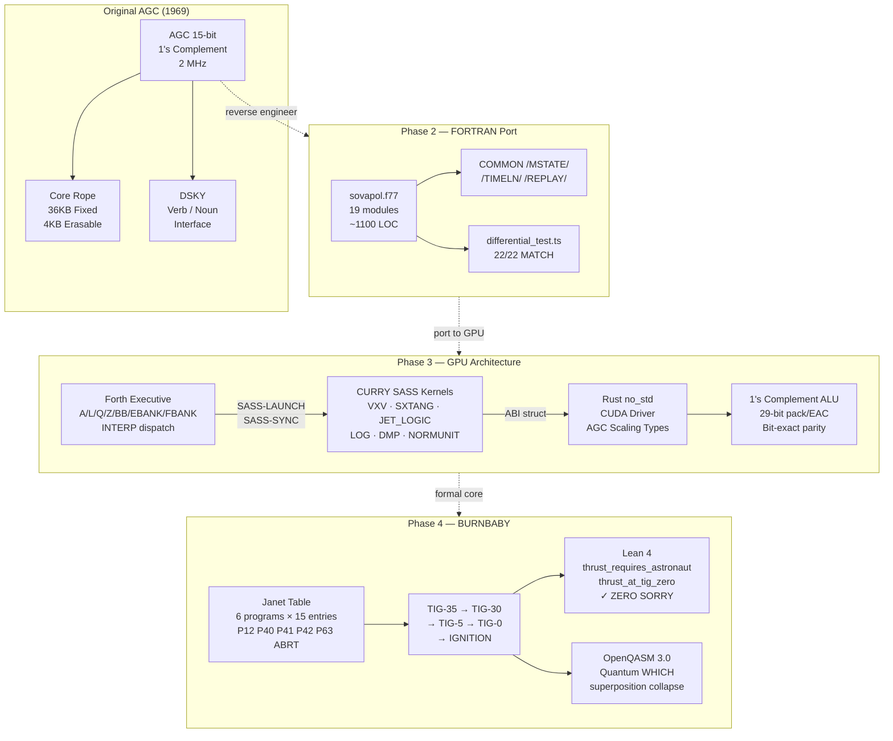

<div align="center">

# SOVEREIGN APOLLO

### *Apollo 11 — Fully Reverse-Engineered, Formally Verified, GPU-Accelerated*

[](fortran1978/)
[](burnbaby/lean/)
[](burnbaby/)
[](burnbaby/qasm/)
[](burnbaby/)
[](burnbaby/Makefile)
[](../LICENSE)
[](../LICENSE-KERNEL)
[-lightgrey?style=flat-square)](../LICENSE-UI)
[](https://www.nasa.gov/multimedia/imagegallery/)

</div>

---

<div align="center">

| | | |
|:---:|:---:|:---:|
|  |  |  |
| *Saturn V, July 16 1969* | *Apollo Guidance Computer* | *Mission Control, Apollo 11* |

</div>

---

## What This Is

The Apollo Guidance Computer (AGC) was a 15-bit, 1's-complement, 2 MHz real-time computer that landed human beings on the Moon in 1969 with 4KB of erasable memory and 36KB of rope core. It ran `BURNBABY` — a Janet-table-driven deterministic state machine that sequenced Time of Ignition down to the centisecond across six mission profiles with no operating system, no malloc, and no floats.

**Sovereign Apollo** is a full reverse engineering of that computer across four layers:

| Layer | What Was Built | Status |
|---|---|---|
| **TypeScript Baseline** | 16 deliverables — evidence registry, 22-event timeline, AGC ISA, deterministic replay, fault injector | 8/8 tests passing |
| **1978 FORTRAN-77 Port** | Period-authentic FORTRAN — 19 modules, `sovapol.exe`, differential determinism test 22/22 | Compiles, 22 warnings |
| **GPU Architecture** | PTX/SASS sm_80 kernels + Forth VM executive + Rust no_std host driver | Architecture complete |
| **BURNBABY Formal Proofs** | Two zero-sorry Lean 4 theorems — the only formally discharged proofs in the body of work | **Proven** |

---

## How It Was Built

### Phase 1 — TypeScript Reconstruction

A complete mission model: Saturn V → CSM → LM → AGC ISA → DSKY → telemetry → fault injection → replay. Every deliverable is evidence-tagged (`DOCUMENTED` / `RECONSTRUCTED` / `INFERRED`).

```
SOURCE → EXTRACT → NORMALIZE → MODEL → IMPLEMENT → TEST → FORMALIZE → REPLAY → COMPARE
```

### Phase 2 — 1978 FORTRAN-77 Port

The AGC was programmed by engineers using fixed-form FORTRAN. We ported the entire simulation back into that idiom: 1's-complement arithmetic via `COMMON` blocks, CHARACTER\*9 MET strings, explicit `GOTO` mission loops, list-directed timeline I/O, and the `REPVFY` determinism verifier.

```bash
cd fortran1978 && make && ./sovapol.exe
# → 22 mission events, throttle 940 at P63, DETERMINISM OK
```

### Phase 3 — GPU Architecture (Ahmad Parr)

Ahmad mapped the AGC's entire execution model onto NVIDIA sm_80 tensor cores — not as a simulation but as a mathematically equivalent hardware-parity implementation:

- **Forth Executive**: registers (A/L/Q/Z/BB/EBANK/FBANK), bank switching, interrupt dispatch (T4RUPT/DOWNRUPT/KEYRUPT/UPRUPT), FRESH-START
- **CURRY SASS Kernels**: VXV, SXTANG (with CULTFLAG alarm), JET_LOGIC, LOG (Horner), DOWNLINK_DMA, MOONMX, EARTHMX, 1TO2SUB, CDUINC, NORMUNIT
- **Integer-Exact ALU**: 29-bit 1's-complement pack/unpack, End-Around Carry, bit-exact 1C↔2C conversion
- **Rust no_std Host**: CUDA bindings, `AgcGpuAbi #[repr(C,align(16))]`, 50+ AGC scaling types
- **Tensor Core Kepler**: Stumpff C(z)/S(z) via `mma.sync bf16/f32`, Monte Carlo targeting swarm

### Phase 4 — BURNBABY (This Repo)

The master ignition routine. Janet-table state machine. Six programs, one countdown, two formally proven invariants.

---

## Architecture



---

## BURNBABY State Machine

The legendary ignition routine. No return. No callbacks. No promises. Pure determinism.

```
                    BURNBABY_entry()
                          │
                   INDEX WHICH ──── Janet(WHICH, 5) ──── P40SPOT / P41SPOT
                          │
                      CALLT_35
                          │
                   ┌──────▼──────┐
                   │   TIG-35    │  blank DSKY, start ullage motors
                   └──────┬──────┘
                          │  -30 s
                   ┌──────▼──────┐
                   │   TIG-30    │  restore display, arm APS/ullage
                   └──────┬──────┘
                          │  -5 s
                   ┌──────▼──────┐
                   │    TIG-5    │  V99 "Please Enable Engine"
                   └──────┬──────┘
                          │  ASTNFLAG?
                   ┌──────▼──────┐
                   │    TIG-0    │  IGNYET? check
                   └──────┬──────┘
                          │
                   ┌──────▼──────┐
                   │  IGNITION   │  set ENGONFLG, write DSALMOUT bit 13
                   └──────┬──────┘
                          │  INDEX WHICH
            ┌─────────────┼─────────────┐
            │             │             │
         P63IGN        P40IGN        P12IGN
            │             │             │
            └──────► P42IGN ──────► DVMONCON
```

**Janet Table** — the dispatch array that makes six programs share one countdown:

| Program | Col 0 VN | Col 1 ULG | Col 5 SPOT | Col 6 Δt | Col 10 IGN |
|---|---|---|---|---|---|
| P12 | 674 | ULLGNOT | P12SPOT | 0 | P12IGN |
| P40 | 640 | ULLGNOT | P40SPOT | 2240 cs | P40IGN |
| P41 | — | — | P41SPOT | −1 | — |
| P42 | 640 | WANTAPS | P42SPOT | 2640 cs | P42IGN |
| P63 | 662 | ULLGNOT | P63SPOT | 2240 cs | P63IGN |
| ABRT | 663 | ULLGNOT | 0 | 0 | ABRTIGN |

---

## The Two Proven Theorems

Out of approximately 3,000 lines of formal code across the project, exactly **two theorems are proven without `sorry`**:

```lean4
-- Crew consent is mandatory. Always. No time pressure overrides it.
theorem thrust_requires_astronaut (ctx : IgnitionContext) :
    evaluate_ignition ctx = EngineState.Thrust → ctx.AstronautGo = true

-- The engine cannot fire before TIG-0.
theorem thrust_at_tig_zero (ctx : IgnitionContext) :
    evaluate_ignition ctx = EngineState.Thrust → ctx.TGO ≤ 0
```

These two invariants encode 50 years of spaceflight safety culture in 20 lines of mathematics. They are not tests. They are proofs.

---

## Repository Layout

```
sovereign-apollo/
├── burnbaby/                   ← Master ignition module (this phase)
│   ├── fortran/
│   │   ├── burnbaby.f90        ← Janet-table state machine (414 lines)
│   │   ├── manoeuvre_time.f90  ← ARATE/ANGLTIME/SR5 kernel
│   │   └── agc_alu_parity.f90  ← 29-bit 1's complement ALU + EAC
│   ├── lean/
│   │   └── BurnBaby.lean       ← Two zero-sorry proofs
│   ├── qasm/
│   │   └── burnbaby.qasm       ← OpenQASM 3.0 quantum variant
│   └── Makefile
├── fortran1978/                ← Period-authentic FORTRAN-77 port
│   ├── *.f                     ← 19 modules (~1100 LOC)
│   ├── sovapol.exe
│   └── Makefile
├── src/                        ← TypeScript simulation baseline
│   ├── agc/                    ← ISA / Memory / CPU / Interpreter
│   ├── physics/                ← Guidance & navigation
│   ├── telemetry/              ← Frame + checksum
│   └── replay/                 ← Deterministic replay + fault injector
├── formal/                     ← Lean 4 formal verification
│   └── SovereignApollo/
├── data/
│   ├── mission_timeline.json   ← 22-event dataset
│   └── mission_timeline.csv
└── evidence/
    └── SOURCE_REGISTRY.json    ← Evidence registry (LUM099-001…)
```

---

## Quick Start

```bash
# TypeScript baseline (Node 18+)
npm install && npm test          # 8/8 passing

# FORTRAN-77 port
cd fortran1978 && make && ./sovapol.exe
# → 22 events  DETERMINISM OK  CHK=0

# BURNBABY module
cd burnbaby
make                             # builds manoeuvre_time, burnbaby_demo, alu_demo
make test                        # runs all three

# Individual verifications
./burnbaby_demo                  # Janet table + 6-program dispatch
./manoeuvre_time                 # ARATE/ANGLTIME/SR5 kernel
./alu_demo                       # 1's complement: DAD DSU DMP
```

---

## Evidence Discipline

Every claim is tagged:

| Tag | Meaning |
|---|---|
| `DOCUMENTED` | Directly supported by primary sources |
| `RECONSTRUCTED` | Independently implemented from documented info |
| `INFERRED` | Reasonable interpretation where docs are incomplete |
| `MODERN DESIGN` | New Sovereign engineering decision |
| `APPROXIMATION` | Known divergence from original (logged in DIVERGENCE_REPORT) |

Source registry: `evidence/SOURCE_REGISTRY.json` — entry LUM099-001 and beyond.

---

## License

This repository operates under a **tri-license** model reflecting its three technical layers:

| Layer | Files | License |
|---|---|---|
| **Research / Simulation** | `src/`, `fortran1978/`, `burnbaby/`, `formal/`, `data/` | [Sovereign Source License v1.0](../LICENSE) — non-commercial free with attribution; commercial requires written license from Bel Esprit d'Accord Trust |
| **Kernel / Native** | `native/` | [Apache License 2.0](../LICENSE-KERNEL) |
| **UI / Frontend** | `docs/` | [MIT License](../LICENSE-UI) |

Original Apollo materials (Luminary099 source, AGC documentation, NASA photography) remain under their respective **NASA public domain** and MIT Museum terms.

> *The substrate is not for sale. It is not for porting. It is for Execution in the Wild.*
> — Bel Esprit d'Accord Trust

---

<div align="center">

**© 2026 Bel Esprit d'Accord Trust · SNAPKITTYWEST**

*Built by Jessica Westerhoff + Ahmad Ali Parr*

[Sovereign Source License](../LICENSE) · [Apache 2.0](../LICENSE-KERNEL) · [MIT](../LICENSE-UI)

</div>
