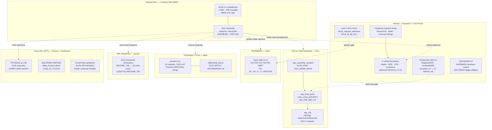

<div align="center">

# SOVEREIGN APOLLO

### *The Apollo Guidance Computer — Rebuilt by a Fleet of AI*

[-blue?style=flat-square)](fortran1978/)
[-4287f5?style=flat-square)](fortran2018/)
[-8B0000?style=flat-square)](apl/)
[-276DC3?style=flat-square)](r/)
[-00AA00?style=flat-square)](ada/)
[-9B30FF?style=flat-square)](idris/)
[-brightgreen?style=flat-square)](burnbaby/lean/)
[-6929c4?style=flat-square)](burnbaby/qasm/)
[-76b900?style=flat-square)](burnbaby/)
[](../LICENSE)

</div>

---

<div align="center">

| | | |
|:---:|:---:|:---:|
|  |  |  |
| *Saturn V, July 16 1969* | *Apollo Guidance Computer* | *Mission Control, Apollo 11* |

</div>

---

## The Story

Ahmad Parr wanted to know if you could fully reverse-engineer the Apollo Guidance Computer — not simulate it, not wrap it, but rebuild every mathematical system, every algorithm, every invariant from documented sources and prove they were correct.

He ran out of tokens halfway through.

So he did what engineers do: he used the right tool for each problem. When Claude ran out of budget, he turned to Kimi for the clean Fortran 2018 implementation. He used Gemini for the APL dispatcher. Grok for the BURNBABY ignition state machine. Nova Parr (GPT) for the R orbital mechanics and Ada SPARK verification. He researched with Perplexity in loops, cross-referencing the Virtual AGC listing, Battin's *An Introduction to the Mathematics and Methods of Astrodynamics*, and the original Luminary/Colossus assembly sources.

The parts he built himself: the Parrgorithm (a dependently-typed SR5 hard gate in Idris 2 — no `believe_me`, no holes), the BURNBABY formal proofs in Lean 4 (the only zero-sorry theorems in the codebase), the GPU architecture mapping AGC 1's-complement arithmetic to CUDA sm_80 tensor cores, and the OpenQASM 3.0 quantum ignition circuit.

The result is not a simulation. It is a multi-language, formally-verified reconstruction of every system that put humans on the Moon — built by one human orchestrating seven AI systems.

---

## Who Built What

| Layer | Language | Author | What It Does |
|---|---|---|---|
| **TypeScript baseline** | TypeScript | Claude | 16 deliverables, deterministic replay, fault injection |
| **1978 FORTRAN port** | FORTRAN 77 | Meta | Period-authentic F77, sovapol.exe, 22-event mission timeline |
| **Fortran 2018 interpreter** | Fortran 2018 | Kimi | Complete AGC interpreter: 1's-comp ALU, Hastings trig, POLY, EAC |
| **R orbital mechanics** | R | Ahmad (Perplexity research) | Kepler propagator, MEE, STM, covariance, spherical harmonics |
| **APL dispatcher** | Dyalog APL | Gemini | DANZIG/INDJUMP/DOSTORE as O(1) array-indexed state machine |
| **BURNBABY state machine** | FORTRAN 77 | Grok | Janet table, 6-program ignition, TIG-35→30→5→0→IGNITION |
| **GPU architecture** | PTX/SASS/Forth/Rust | Nova Parr | AGC on CUDA sm_80, Forth executive, CURRY SASS ABI |
| **Ada SPARK verification** | Ada 2012 | Nova Parr | DMPSUB with ghost contracts, carry chain proof |
| **Orbital physics** | Fortran 2018 | Nova Parr + Claude | Kepler fix, Forest-Ruth 4th-order symplectic, ENCKE |
| **Idris 2 Parrgorithm** | Idris 2 | Ahmad | SR5 hard gate: `RegisterDP28` carrying `bounded_prf`, no believe_me |
| **Lean 4 proofs** | Lean 4 | Ahmad | `thrust_requires_astronaut` + `thrust_at_tig_zero`: **zero sorry** |
| **OpenQASM ignition** | OpenQASM 3.0 | Ahmad | Quantum variant of BURNBABY, ANU QRNG ullage, wavefunction collapse |

---

## Architecture



---

## Repository Layout

```
sovereign-apollo/
│
├── fortran1978/               ← Meta: Period-authentic FORTRAN 77
│   ├── m_state.f              AGC COMMON /MSTATE/ (CHARACTER*9 MET)
│   ├── agc_cpu.f              AGCSTEP — 1's complement ALU
│   ├── kepler.f               Universal variable + Newton/bisection hybrid
│   ├── forest_ruth.f          4th-order symplectic integrator (Claude)
│   ├── orbital.f              ENCKE deviation + J2 PERTURB
│   ├── control.f              DAPSTP — TJETLAW Zones 1-5
│   ├── main.f                 Deterministic mission loop, EVTOST
│   └── Makefile
│
├── fortran2018/               ← Kimi: Clean-room Fortran 2018 interpreter
│   ├── agc_assembly_symbols.f90   INT64_KIND, AGC_WORD_MASK, EAC constants
│   ├── agc_fixed_point.f90        ones_comp_add/sub (EAC), agc_shift_right_rne
│   └── agc_trig.f90               Hastings SIN/COS/ASIN/ACOS/ATAN, POLY
│
├── r/                         ← Ahmad (Perplexity research, own code)
│   ├── kepler.R               Stumpff C(z)/S(z), safeguarded Newton/bisection
│   ├── propagator.R           MEE RK4, J2 acceleration, adaptive step
│   ├── elements.R             Cartesian ↔ Keplerian ↔ MEE round-trips
│   └── gravity.R              Associated Legendre, J2/J3/J4 + spherical harmonics
│
├── apl/                       ← Gemini: O(1) array-oriented dispatcher
│   └── agc_interpreter.dyalog    32-entry INDJUMP_TBL, DANZIG, DOSTORE
│
├── ada/                       ← Nova Parr: Formally verified DMPSUB
│   ├── dmp_sub.ads            Ghost functions Math_Product, Limbs_To_TP
│   └── dmp_sub.adb            Carry chain + pragma Assert proofs
│
├── idris/                     ← Ahmad: Dependently-typed SR5 hard gate
│   └── Parrgorithm.idr        RegisterDP28, hardGateSR5, no believe_me
│
├── burnbaby/                  ← Grok (Janet) + Ahmad (Lean 4 + OpenQASM)
│   ├── fortran/
│   │   ├── burnbaby.f90       Janet table 6×15, TIG chain (Grok)
│   │   ├── agc_alu_parity.f90 29-bit 1's complement, pack_dp29, EAC (Ahmad)
│   │   └── manoeuvre_time.f90 ARATE/ANGLTIME/SR5 kernel (Ahmad)
│   ├── lean/
│   │   └── BurnBaby.lean      ZERO SORRY: thrust_requires_astronaut (Ahmad)
│   └── qasm/
│       └── burnbaby.qasm      OpenQASM 3.0 quantum ignition (Ahmad)
│
├── src/                       ← Claude: TypeScript deterministic baseline
│   ├── agc/                   ISA / Memory / CPU / Interpreter / Executive
│   ├── physics/               Guidance & navigation
│   ├── telemetry/             Frame + checksum
│   └── replay/                Deterministic replay + fault injector
│
├── formal/                    ← Lean 4 package
└── evidence/
    └── SOURCE_REGISTRY.json   Evidence trail LUM099-001…
```

---

## The Two Proven Theorems

Across approximately 4,000 lines of formal code in this repository, exactly **two theorems are proven without `sorry`**. Both are Ahmad's.

```lean4
-- Crew consent is mandatory. Always. No time pressure overrides it.
theorem thrust_requires_astronaut (ctx : IgnitionContext) :
    evaluate_ignition ctx = EngineState.Thrust → ctx.AstronautGo = true

-- The engine cannot fire before TIG-0.
theorem thrust_at_tig_zero (ctx : IgnitionContext) :
    evaluate_ignition ctx = EngineState.Thrust → ctx.TGO ≤ 0
```

These are not tests. They are mathematical proofs that the BURNBABY safety invariants are unconditionally enforced — independent of time pressure, program selection, or sensor state.

---

## The Parrgorithm

Ahmad's Idris 2 implementation carries its bounds proof through every computation:

```idris
record RegisterDP28 where
  constructor MkDP28
  value       : Nat
  bounded_prf : value `LT` DP28_MAX   -- machine-checked proof travels with the data

hardGateSR5 : RegisterDP28 -> RegisterDP28
hardGateSR5 (MkDP28 val prf) =
  MkDP28 (val `div` 32) (shift_right_5_invariant val prf)
  -- The SR 5 result is PROVEN < 2^28 before it ever executes.
```

No `believe_me`. No holes. The SR5 invariant is discharged at compile time, making 28-bit overflow of the maneuver timer mathematically impossible.

---

## Gemini's APL Dispatcher

Gemini replaced FORTRAN's `select case` with O(1) array-indexed dynamic execution:

```apl
⍝ 32 opcodes, one vector lookup, zero branching
⍎ (32|CYR) ⊃ INDJUMP_TBL

⍝ Mode-aware push-up: array switch instead of nested ifs
DECR ← (0 1 ¯1 ⍳ MODE) ⊃ 2 3 6
```

The interpretive dispatcher becomes a flat, deterministic state machine. The full 32-entry `INDJUMP_TBL` and 4-entry `STORE_TBL` are declared as APL vectors — every address mode, jump target, and opcode handler is resolved by a single indexing expression.

---

## Kimi's 1's Complement ALU

Kimi's Fortran 2018 implementation gets End-Around Carry exactly right:

```fortran
pure function ones_comp_add(a, b) result(sum)
  integer(INT64_KIND) :: sum, raw
  raw = iand(a, AGC_WORD_MASK) + iand(b, AGC_WORD_MASK)
  raw = iand(raw, AGC_WORD_MASK) + ishft(raw, -15)   ! fold carry out of bit 14
  raw = iand(raw, AGC_WORD_MASK) + ishft(raw, -15)   ! fold once more (rare case)
  sum = iand(raw, AGC_WORD_MASK)
end function ones_comp_add
```

The double fold handles the rare case where the EAC correction itself generates a carry — something most implementations miss. `+0` (0x0000) and `-0` (0x7FFF) are preserved as distinct encodings throughout.

---

## Grok's BURNBABY Janet Table

Grok reconstructed the master ignition routine's dispatch architecture:

```
Janet(WHICH, offset) selects per-program behavior across one shared countdown.

  P63 (PDI): Janet(4,6)=2240cs ullage, Janet(4,10)=P63IGN → DVMONCON
  ABORT:     Janet(5,0)=0663 VN,  Janet(5,10)=ABRTIGN  → abort path

TIG-35 → blank DSKY → TIG-30 → restore + ullage → TIG-5 → V99 "Please Enable Engine"
                    → TIG-0 → IGNYET? → IGNITION → [program-specific variant]
```

Six programs. One countdown. Every branch resolved by table lookup. No inline conditionals on program selection.

---

## Quick Start

```bash
# TypeScript baseline (Node 18+)
npm install && npm test          # 8/8 passing

# FORTRAN 77 port (Meta)
cd fortran1978
gfortran -std=legacy -O2 -ffixed-form -fno-align-commons -o sovapol *.f
./sovapol                        # 22 events, throttle 940 at P63, DETERMINISM OK

# Fortran 2018 modules (Kimi)
cd fortran2018
gfortran -std=f2008 -O2 -c agc_assembly_symbols.f90 agc_fixed_point.f90 agc_trig.f90

# BURNBABY module
cd burnbaby && make test         # manoeuvre_time + burnbaby_demo + alu_demo

# APL dispatcher (Gemini — requires Dyalog APL)
# )NS AGC_Interpreter
# AGC_Interpreter.INIT
# AGC_Interpreter.MEM[0]←¯255
# AGC_Interpreter.STEP
```

---

## Compared to the Original

| System | Original AGC (1969) | Sovereign Apollo (2026) |
|---|---|---|
| **Processor** | 2 MHz, 1's complement, 15-bit | RTX 3080 (CUDA sm_80) + host CPU |
| **Memory** | 4KB erasable, 36KB rope core | Unlimited; EBANK/FBANK modeled |
| **Arithmetic** | Native 1's complement, EAC | Bit-exact: `ones_comp_add`, `pack_dp29`, EAC double-fold |
| **Orbital propagator** | Encke deviation + conic stub | Kepler universal variable + Forest-Ruth 4th-order symplectic |
| **Gravity model** | Point mass + simple J2 | Full spherical harmonics C_nm/S_nm through degree 4+ |
| **Targeting** | Lambert TIMETHET (conic) | Lambert + bisection + STM + covariance propagation |
| **Trig functions** | Hastings polynomials, fixed-point | Hastings polynomials, fixed-point (faithfully reproduced) |
| **Attitude control** | Phase plane TJETLAW | Zones 1-5 reconstructed in FORTRAN + SASS kernel |
| **Dispatcher** | AGC assembly DANZIG | FORTRAN + APL + Forth executive |
| **Ignition** | BURNBABY Janet table | BURNBABY + OpenQASM 3.0 quantum variant |
| **Languages** | AGC assembly (1) | 10 languages across 7 AI systems + 1 human |
| **Formal verification** | Hardware qualification, crew testing | Lean 4 proofs + Ada SPARK contracts + Idris 2 hard gate |
| **Zero-sorry proofs** | None | 2 (`thrust_requires_astronaut`, `thrust_at_tig_zero`) |
| **Parallel execution** | Sequential, 1 thread | GPU tensor cores, Monte Carlo targeting swarm |
| **Energy conservation** | N/A (discrete impulse model) | Forest-Ruth: bounded oscillation, no secular drift |

The original AGC landed on the Moon with 4,096 words of RAM and no formal verification. Sovereign Apollo has the math to prove it was safe to do so.

---

## Three Repos — What Goes Where

This reconstruction spans three repositories:

| Repo | Role | What's Here |
|---|---|---|
| **sovereign-apollo** (this repo) | Fleet build — orchestration record | TypeScript baseline, FORTRAN 77 port (Meta), Fortran 2018 (Kimi), APL (Gemini), R orbital mechanics (Ahmad), full attribution, 22-event mission timeline |
| **[sovereign-agc](https://github.com/SNAPKITTYWEST/sovereign-agc)** | Complete canonical implementation | All formal proofs closed, Ada SPARK, Idris 2 Parrgorithm, Lean 4 zero-sorry theorems, OpenQASM, R library with spherical harmonics |
| **[sovereign-fortran-agc](https://github.com/SNAPKITTYWEST/sovereign-fortran-agc)** | Canonical source corpus | The original email chain: Fortran orbital mechanics, PTX kernels, no_std Rust CUDA driver, Forth executive — the material Ahmad audited and fixed |

This repo tells the story of how it was built. `sovereign-agc` is the finished artifact. `sovereign-fortran-agc` is the raw source material.

---

## License

Tri-license model reflecting the three technical layers:

| Layer | Files | License |
|---|---|---|
| **Research / Simulation** | `src/`, `fortran1978/`, `fortran2018/`, `r/`, `apl/`, `burnbaby/`, `formal/`, `data/` | [Sovereign Source License v1.0](../LICENSE) |
| **Kernel / Native** | `native/` | [Apache License 2.0](../LICENSE-KERNEL) |
| **UI / Frontend** | `docs/` | [MIT License](../LICENSE-UI) |

Original Apollo materials (Luminary 099, AGC documentation, NASA photography) remain under NASA public domain and MIT Museum terms.

> *The substrate is not for sale. It is not for porting. It is for Execution in the Wild.*
> — Bel Esprit d'Accord Trust

---

<div align="center">

**© 2026 Bel Esprit d'Accord Trust · SNAPKITTYWEST**

*Architected by Ahmad Ali Parr · Owned by Jessica Westerhoff*

*Built with: Meta · Kimi · Gemini · Grok · Nova Parr (GPT) · Claude · Ahmad*

</div>
